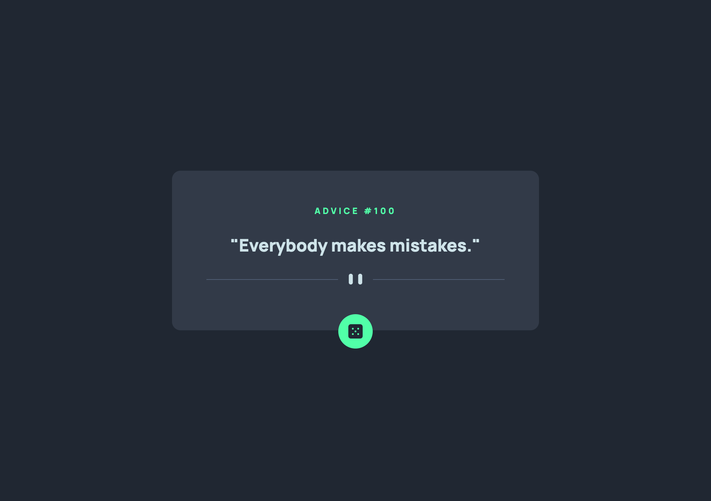

# Frontend Mentor - Advice generator app solution

This is a solution to the [Advice generator app challenge on Frontend Mentor](https://www.frontendmentor.io/challenges/advice-generator-app-QdUG-13db). Frontend Mentor challenges help you improve your coding skills by building realistic projects.

## Table of contents

- [Overview](#overview)
  - [The challenge](#the-challenge)
  - [Screenshot](#screenshot)
  - [Links](#links)
- [My process](#my-process)
  - [Built with](#built-with)
  - [What I learned](#what-i-learned)
  - [Useful resources](#useful-resources)
- [Author](#author)

## Overview

### The challenge

Users should be able to:

- View the optimal layout for the app depending on their device's screen size
- See hover states for all interactive elements on the page
- Generate a new piece of advice by clicking the dice icon

### Screenshot

### Links

- Solution URL: [Add solution URL here](https://github.com/walidov/advice-generator-app)
- Live Site URL: [Add live site URL here](https://advice-generator-app-waleed-dev.netlify.app/)

## My process

### Built with

- Semantic HTML5 markup
- CSS custom properties
- Flexbox
- Mobile-first workflow
- [React](https://reactjs.org/) - JS library
- [TailwindCSS](https://tailwindcss.com/) - For styles
- [Lucid Icons](https://lucide.dev/) - For icons

### What I learned

- How to use React hooks (useState, useEffect) and how to call an API using Fetch API.
- How to customize TailwindCSS predefined classes using @theme {}.
- How to sping an icon using TailwindCSS predefined class.
- How to fetch the API once upon the component mount, using emptu useEffect dependency.
- How to centralize the main block in the page vertically and horizontally using Flexbox anf TailwindCSS predefined classes.

### Useful resources

- [Advice Slip API](https://api.adviceslip.com/) - This provides a REST API to fetch random general advices.

## Author

- Website - [Moslim Dev](https://moslim.dev)
- Frontend Mentor - [@walidov](https://frontendmentor.io/profile/walidov)
- Twitter - [@walidov](https://x.com/walidov)